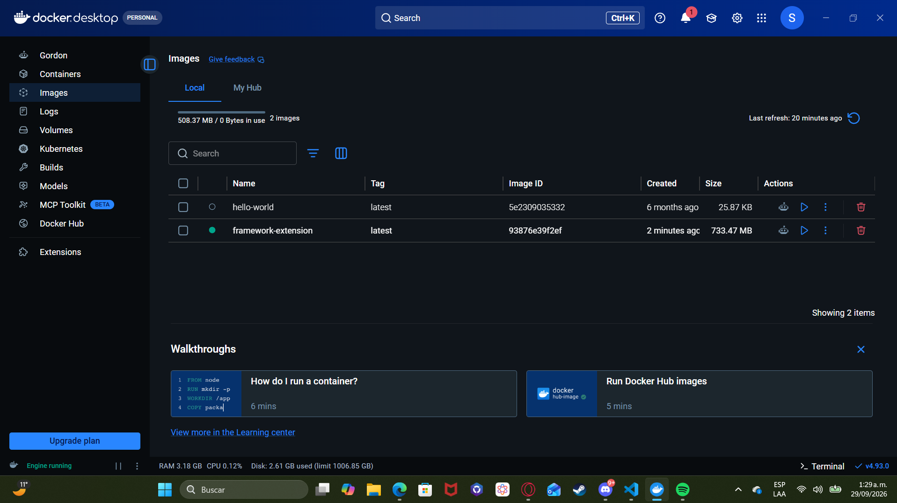
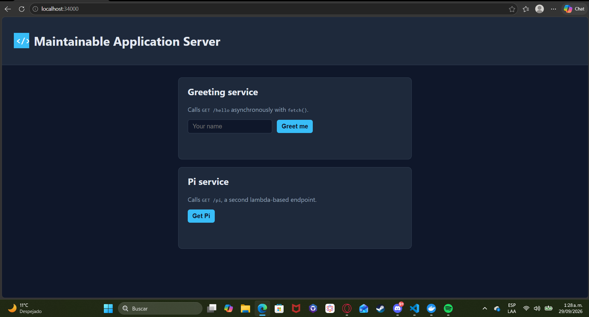
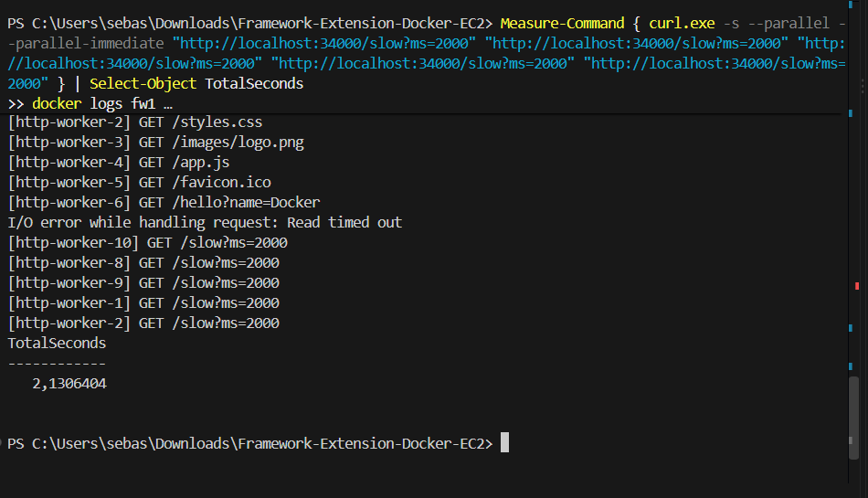
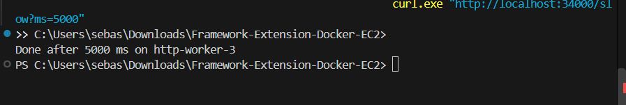
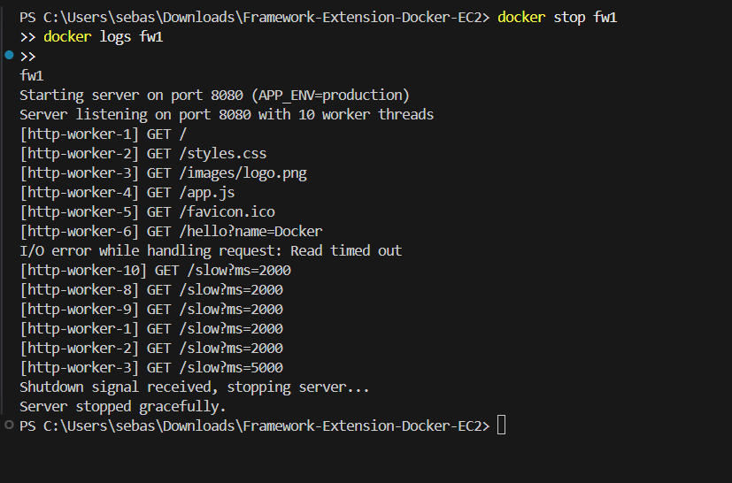
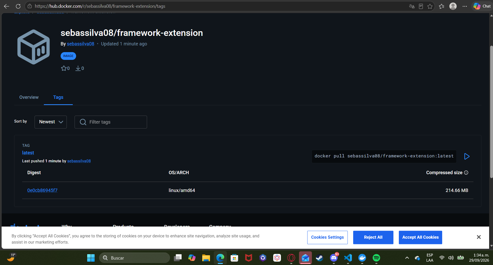
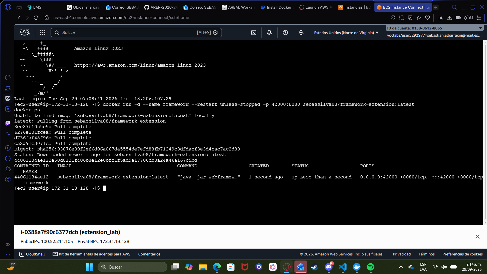
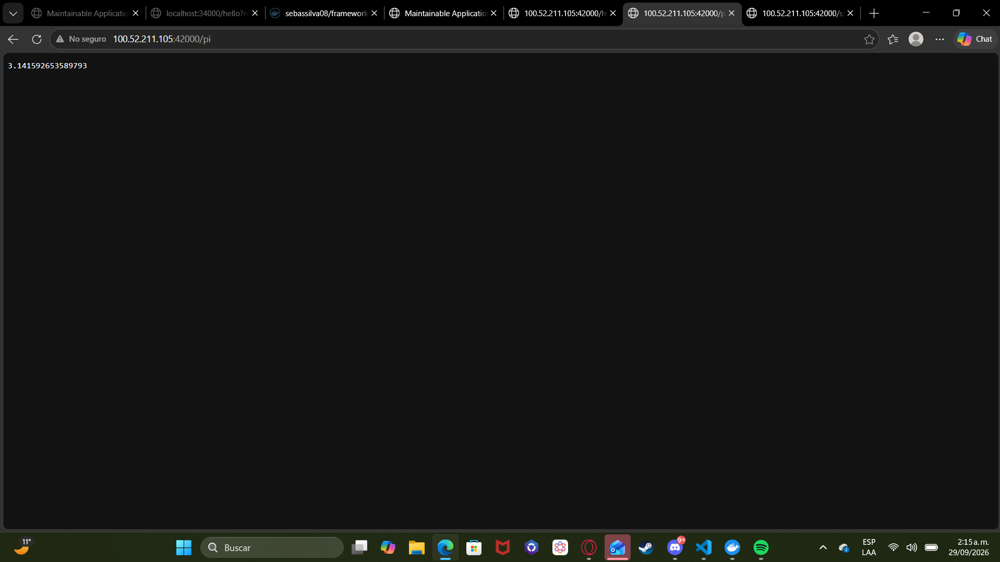
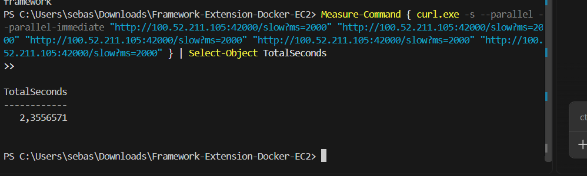
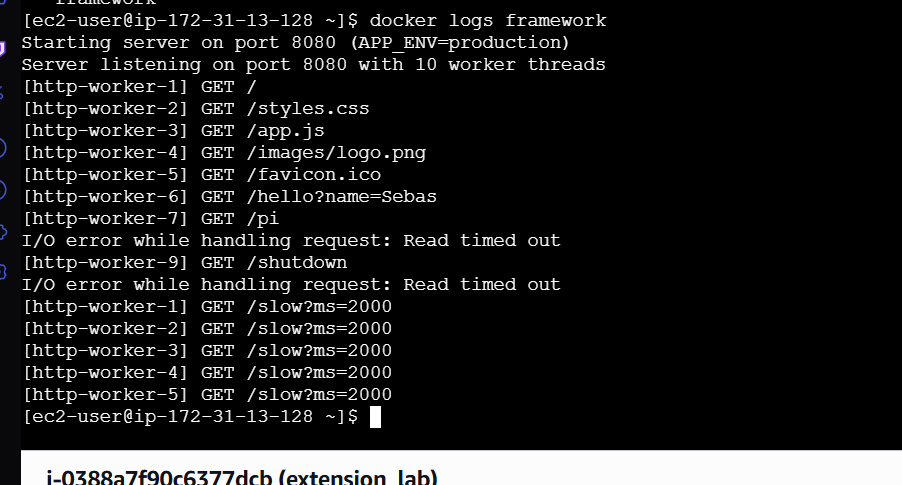

# Framework Extension: Concurrency, Graceful Shutdown, Docker and AWS EC2

This project extends the lambda-based Java web framework from the previous lab
(*Building and Deploying a Maintainable Application Server*). It does not use Spring.
The framework now:

1. **Serves requests concurrently.** Each connection runs on a pool of worker threads.
2. **Shuts down gracefully.** It stops accepting connections, finishes the requests
   already in progress, and then exits. This works for `docker stop` (SIGTERM),
   Ctrl+C and the dev-only `/shutdown` route.
3. **Runs in Docker.** The image is based on `amazoncorretto:21` and is published to Docker Hub.
4. **Is deployed on AWS EC2** as a Docker container.

## MADE BY
- Sebastian Albarracin Silva

## Extension commit

All the framework changes for this assignment are in a single commit:

**[`e10231c313b8eb36c664d081d48ae396a3385bcb`](../../commit/e10231c313b8eb36c664d081d48ae396a3385bcb)**:
*Implement concurrent request handling, graceful shutdown and Docker deployment*

To see exactly what the commit changed:

```bash
git show e10231c --stat
```

## 1. What changed in the framework

| Requirement | Before (previous lab) | Now |
|---|---|---|
| Concurrent requests | `HttpServer` handled **one connection at a time** in its accept loop. | The accept loop only accepts connections and passes each socket to a **fixed thread pool** (`ExecutorService`, `THREAD_POOL_SIZE` workers). A slow request no longer blocks the others. |
| Graceful shutdown | `stop()` only set a flag, so `accept()` stayed blocked until another request arrived. Nothing handled SIGTERM. | `stop()` sets the flag **and closes the `ServerSocket`**, which unblocks `accept()` right away. The pool is then `shutdown()` and the server waits (`awaitTermination`) for in-flight requests, up to `SHUTDOWN_TIMEOUT_SECONDS`. A **JVM shutdown hook** does the same on SIGTERM or Ctrl+C. |
| Port from the environment | `PORT` (default `8080`) | Unchanged. `THREAD_POOL_SIZE` and `SHUTDOWN_TIMEOUT_SECONDS` were added. |
| Thread safety | Not relevant | `Router` uses a `ConcurrentHashMap`. Each request builds its own `Request` and `Response` objects, so no mutable state is shared between workers. |
| Stuck clients | Not handled | Each client socket has a 10 s read timeout, so a client that never sends a request cannot hold a worker forever. |
| Containerization | None | A multi-stage `Dockerfile` (Maven build, then an `amazoncorretto:21` runtime). |

The public API for application developers is **unchanged**:

```java
staticfiles("/webroot");
get("/hello", (req, resp) -> "Hello " + req.getValue("name"));
start();
```

### How the server works now

```
               ┌────────────────────── HttpServer ───────────────────────┐
 TCP client ──►│ accept loop (main thread)                               │
               │   while (running) socket = serverSocket.accept()        │
               │   workers.execute(() -> handleConnection(socket))       │
               │                         │                               │
               │        ┌────────────────┼────────────────┐              │
               │        ▼                ▼                ▼              │
               │  http-worker-1    http-worker-2 ... http-worker-N       │
               │   parse request ─► Router ─► lambda   (or static file)  │
               └──────────────────────────────────────────────────────────┘
```

### Graceful shutdown sequence

```
docker stop  ──SIGTERM──►  JVM runs the shutdown hook
                               │
                               ├─ HttpServer.stop()
                               │     running = false
                               │     serverSocket.close()   → accept() unblocks,
                               │                              new connections are refused
                               │
                               ├─ accept loop exits → workers.shutdown()
                               │     workers.awaitTermination(SHUTDOWN_TIMEOUT_SECONDS)
                               │       → in-flight requests finish and get their responses
                               │
                               └─ "Server stopped gracefully." → JVM exits (code 143)
```

Docker gives a container **10 seconds** after SIGTERM before it sends SIGKILL. That is
why the default `SHUTDOWN_TIMEOUT_SECONDS` is **8**, so the drain always finishes first.
If you raise it, also raise Docker's grace period (`docker stop -t 30 ...`).

The `Dockerfile` uses the exec form `ENTRYPOINT ["java", ...]`. With that form, `java`
is PID 1 in the container and receives the SIGTERM directly. The shell form would give
the signal to `/bin/sh` instead.

### Components

| Component | Responsibility |
|---|---|
| `WebFramework` | Public facade (`staticfiles`, `get`, `start`, `stop`). Reads `PORT`, `THREAD_POOL_SIZE` and `SHUTDOWN_TIMEOUT_SECONDS`, and registers the shutdown hook. |
| `HttpServer` | Owns the `ServerSocket`, the accept loop, the worker thread pool and the stop/drain lifecycle. Parses requests and dispatches them. |
| `Router` | Thread-safe map from each path to its lambda. |
| `Service` | Functional interface for route lambdas: `(Request, Response) -> String`. |
| `Request` / `Response` | Per-request view of the query parameters and the status code / content type. |
| `StaticFileService` | Serves classpath resources under `/webroot` as raw bytes. |
| `Application` | Example app: `/hello`, `/pi`, `/time`, `/env`, `/slow`, the dev-only `/shutdown`, and static files. |

## 2. Environment variables

| Variable | Purpose | Default |
|---|---|---|
| `PORT` | TCP port the server binds to | `8080` |
| `THREAD_POOL_SIZE` | Number of worker threads, which is the maximum number of requests handled at the same time | `10` |
| `SHUTDOWN_TIMEOUT_SECONDS` | Maximum time to wait for in-flight requests during shutdown | `8` |
| `APP_ENV` | `development` or `production`. `/shutdown` exists only in development. | `development` (the Docker image sets `production`) |
| `GREETING_PREFIX` | Prefix used by `/hello` | `Hello` |
| `STATIC_FILES_PATH` | Classpath root for static resources | `/webroot` |

## 3. Endpoints

| URL | Result |
|---|---|
| `/` | `index.html` (static) |
| `/images/logo.png` | Static binary image |
| `/hello?name=Sebas&language=es` | `Hello Sebas (es)` |
| `/pi` | `3.141592653589793` |
| `/time` | Current server time |
| `/env` | `APP_ENV=...` |
| `/slow?ms=3000` | Waits `ms` milliseconds (max 10000) and replies with the worker thread's name. It is used to show concurrency and graceful shutdown. |
| `/shutdown` | Stops the server gracefully. Only exists when `APP_ENV=development`. |

## 4. Build, test and run locally

Requirements: JDK 17+ and Maven 3.9+.

```bash
mvn clean package          # compiles and runs the tests
java -jar target/webframework.jar
```

### Automated tests

`src/test/java/.../HttpServerTest.java` starts a real server on a random port and checks that:

- `servesSlowRequestsInParallel`: 5 requests of 1 s each finish in less than 2 s. Served one after another, they would take 5 s.
- `fastRequestIsNotBlockedBySlowOne`: `/ping` answers right away while `/slow` is still running.
- `gracefulShutdownFinishesInFlightRequestAndRejectsNewOnes`: after `stop()`, new connections are refused, but the `/slow` request already in progress still gets `200 slow done`.

```
[INFO] Tests run: 3, Failures: 0, Errors: 0, Skipped: 0
```

### Manual concurrency and shutdown check (local jar)

```bash
$ PORT=8095 java -jar target/webframework.jar &

# 5 requests of 2 s each, sent at the same time
$ for i in 1 2 3 4 5; do curl -s "http://localhost:8095/slow?ms=2000" & done; wait
Done after 2000 ms on http-worker-3
Done after 2000 ms on http-worker-4
Done after 2000 ms on http-worker-2
Done after 2000 ms on http-worker-1
Done after 2000 ms on http-worker-5
total: 2129 ms              # served one at a time, this would take ~10 000 ms

# a 3 s request is in progress when /shutdown is called
$ curl -s "http://localhost:8095/slow?ms=3000" &
$ curl -s http://localhost:8095/shutdown
Server will stop after this response.
$ curl -s -o /dev/null -w "%{http_code}\n" http://localhost:8095/pi
000                         # new connections are refused
in-flight got: Done after 3000 ms on http-worker-6   # the in-flight request still finished

# server log
Server listening on port 8095 with 10 worker threads
[http-worker-6] GET /slow?ms=3000
[http-worker-7] GET /shutdown
Server stopped gracefully.
```

## 5. Docker

### 5.1 Dockerfile

```dockerfile
FROM maven:3.9-amazoncorretto-21 AS build
WORKDIR /build
COPY pom.xml .
RUN mvn -q dependency:go-offline
COPY src ./src
RUN mvn -q clean package -DskipTests

FROM amazoncorretto:21
WORKDIR /usrapp/bin
ENV PORT=8080 APP_ENV=production GREETING_PREFIX=Hello \
    THREAD_POOL_SIZE=10 SHUTDOWN_TIMEOUT_SECONDS=8
COPY --from=build /build/target/webframework.jar ./webframework.jar
EXPOSE 8080
ENTRYPOINT ["java", "-jar", "webframework.jar"]
```

The multi-stage build compiles inside Docker, so a local JDK is not needed to build the
image. The final image contains only the Corretto 21 runtime and the jar.

### 5.2 Build and run locally

```bash
docker build -t framework-extension .
docker images

docker run -d --name fw1 -p 34000:8080 framework-extension
docker run -d --name fw2 -p 34001:8080 -e THREAD_POOL_SIZE=4 framework-extension
docker ps
```

Open `http://localhost:34000/` and `http://localhost:34001/hello?name=Docker`.

### 5.3 Graceful shutdown in the container

```bash
curl "http://localhost:34000/slow?ms=5000" &   # request in progress
docker stop fw1                                # sends SIGTERM
docker logs fw1
```

Expected log:

```
Server listening on port 8080 with 10 worker threads
[http-worker-1] GET /slow?ms=5000
Shutdown signal received, stopping server...
Server stopped gracefully.
```

The `curl` still prints `Done after 5000 ms ...`, and `docker ps -a` shows the container
exited in about 5 s instead of being killed after 10 s.

### 5.4 Publish to Docker Hub

- **Image:** [`sebassilva08/framework-extension`](https://hub.docker.com/r/sebassilva08/framework-extension)

```bash
docker login
docker tag framework-extension sebassilva08/framework-extension:latest
docker push sebassilva08/framework-extension:latest
```

## 6. Deployment on AWS EC2

### 6.1 Instance and security group

1. EC2 → Launch instance → Amazon Linux 2023, `t2.micro`/`t3.micro`.
2. Security group inbound rules:
   - `22/tcp` (SSH) from your IP.
   - `42000/tcp` from `0.0.0.0/0`. This is the public port mapped to the container.

### 6.2 Install Docker on the instance

```bash
ssh -i labsuser.pem ec2-user@100.52.211.105

sudo dnf update -y
sudo dnf install -y docker
sudo systemctl enable --now docker
sudo usermod -aG docker ec2-user
exit          # log in again so the docker group applies
```

### 6.3 Run the image from Docker Hub

```bash
ssh -i labsuser.pem ec2-user@100.52.211.105

docker run -d --name framework --restart unless-stopped \
  -p 42000:8080 \
  -e APP_ENV=production \
  sebassilva08/framework-extension:latest

docker ps
docker logs framework
```

### 6.4 Public URL

- **Public URL:** http://100.52.211.105:42000/

| URL | Expected result |
|---|---|
| `http://100.52.211.105:42000/` | Static `index.html` |
| `http://100.52.211.105:42000/hello?name=Sebas` | `Hello Sebas` |
| `http://100.52.211.105:42000/pi` | `3.141592653589793` |
| `http://100.52.211.105:42000/slow?ms=3000` | `Done after 3000 ms on http-worker-N` |
| `http://100.52.211.105:42000/shutdown` | `404 Not Found` (production) |

## 7. Evidence

### 7.1 Local Docker image and container

The `framework-extension` image built from the `Dockerfile`:



The container running locally (`-p 34000:8080`), serving the static page and the `/hello` endpoint:




### 7.2 Concurrency in the local container

Five `/slow?ms=2000` requests sent at the same time finish in **2.13 s** instead of ~10 s.
The log shows each one handled by a different worker thread:



### 7.3 Graceful shutdown in the local container

A `/slow?ms=5000` request was in progress when `docker stop fw1` sent SIGTERM. The request
still received its full response:



The container log shows the shutdown hook stopping the server only after that request finished:



### 7.4 Image on Docker Hub



### 7.5 Container running on AWS EC2

The image was pulled from Docker Hub and started on the EC2 instance with the port mapping `42000:8080`:



### 7.6 Public endpoints on EC2

`GET /hello?name=Sebas`:


`GET /pi`:



`GET /shutdown` returns `404 Not Found`, because the route is not registered with `APP_ENV=production`:


### 7.7 Concurrency on EC2

Five `/slow?ms=2000` requests sent to the public URL at the same time finish in **2.36 s**, including network latency:



In the container log on the instance, each request is handled by a different worker (`http-worker-1` to `http-worker-5`):


